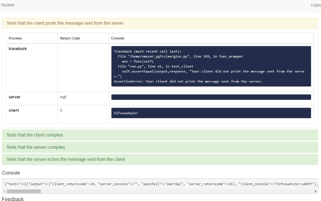

# PrettyBonnie

A Chrome extension for making Bonnie output prettier.

;

## Installation

https://chrome.google.com/webstore/detail/pretty-bonnie/pgmdghgcpijfocohpmljfcimlenibhgl

## Courses

PrettyBonnie is only known to work for the following courses in Georgia Tech's [OMSCS program](http://www.omscs.gatech.edu/):

- CS6200: Graduate Introduction to Operating Systems
- CS6476: Computer Vision
  - Does not yet support `unauthorized_lib_calls` output

Would appreciate any testing on other courses and make an issue for what needs to be implemented.